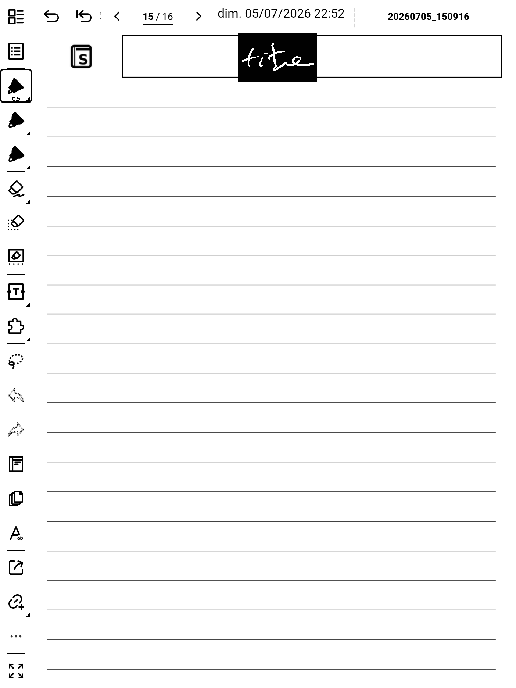
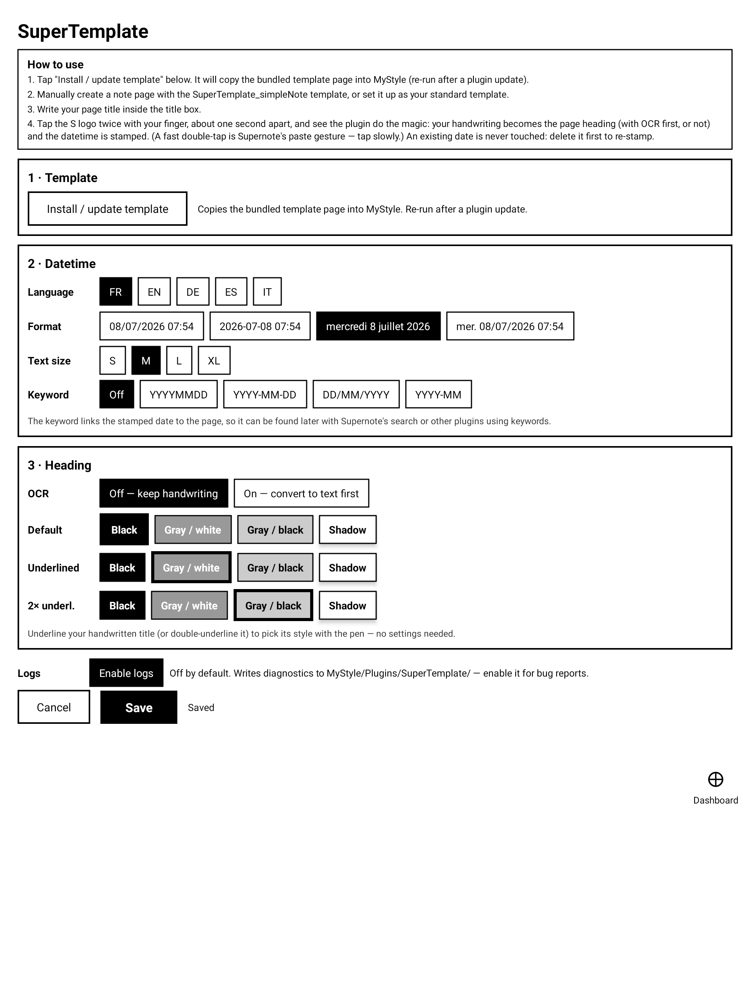
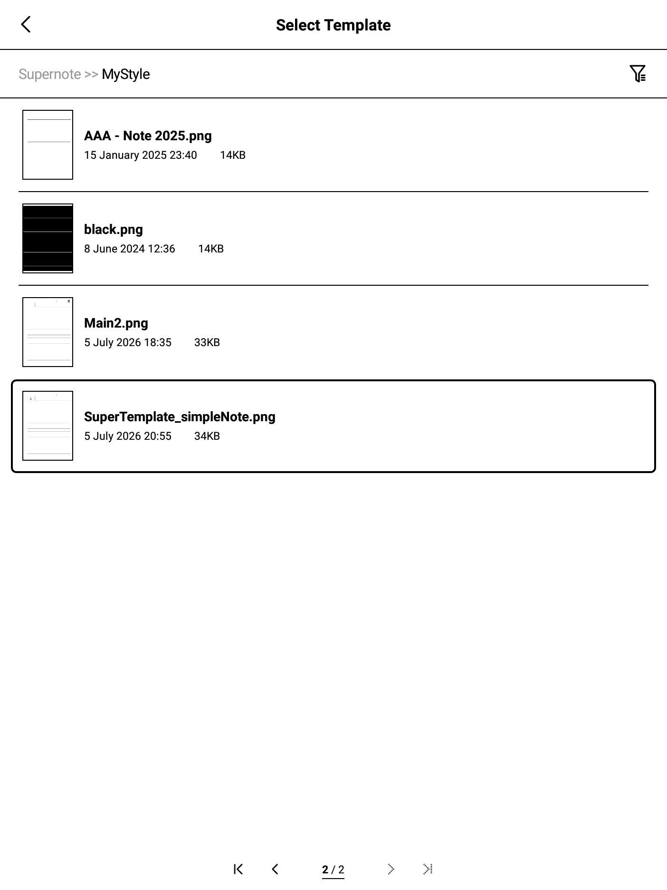
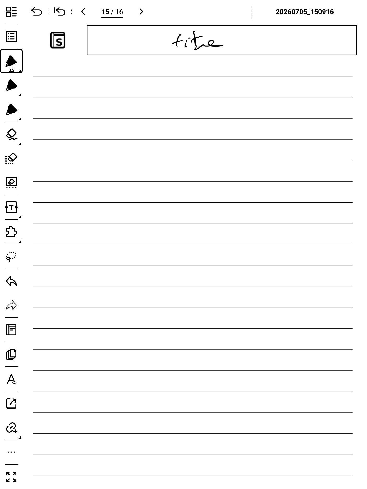
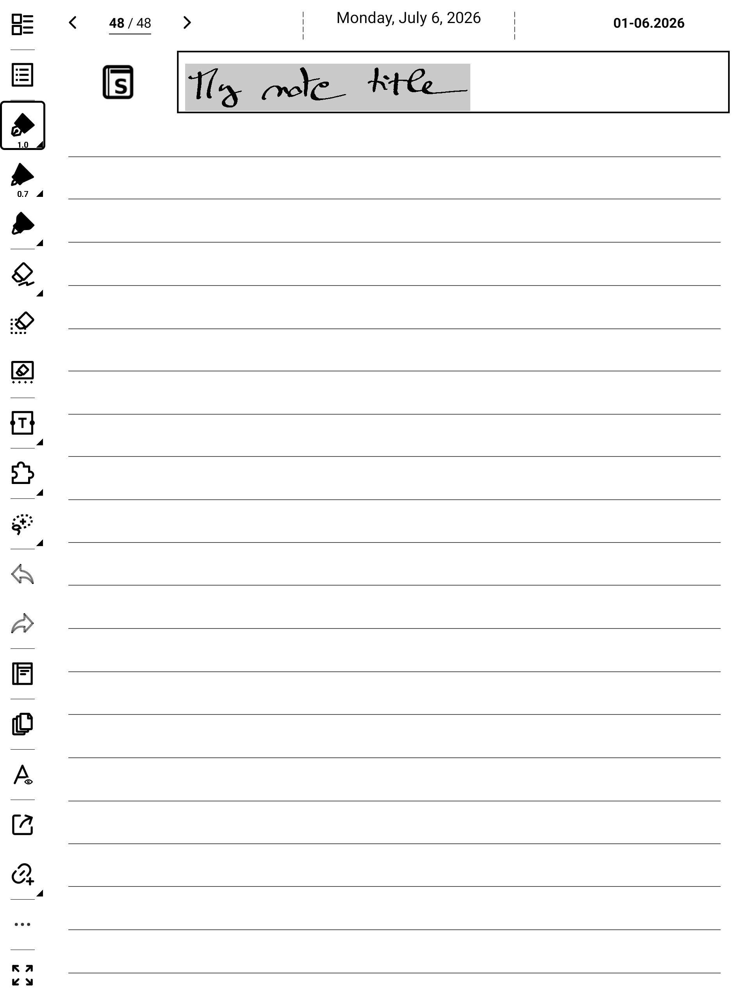
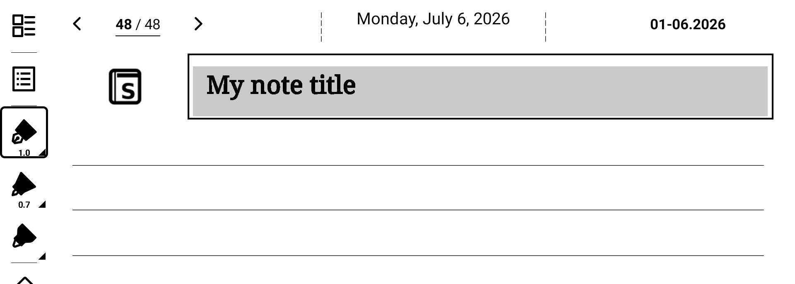
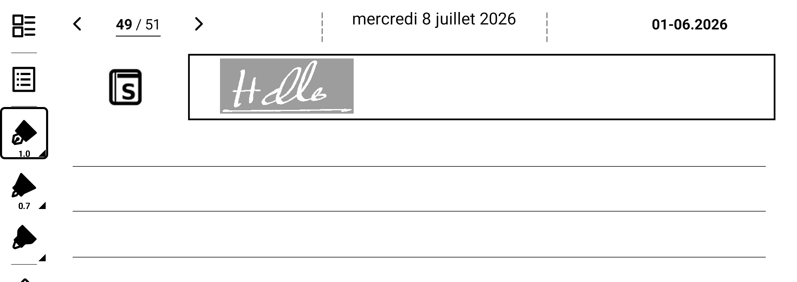
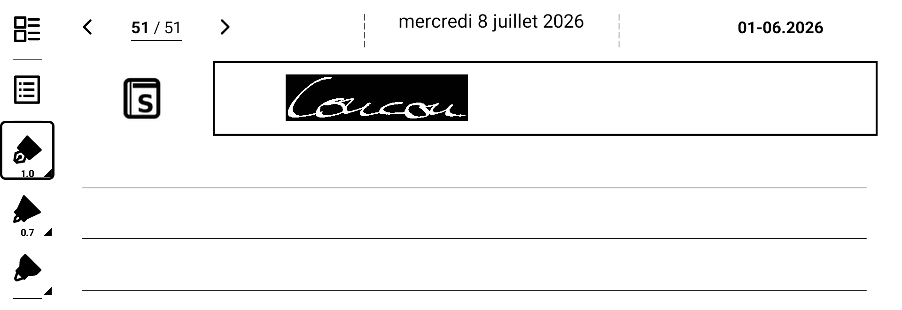
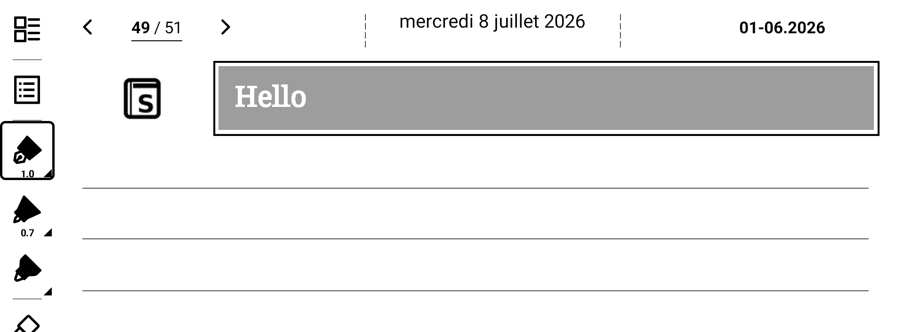

# SuperTemplate — User Manual

*Version 0.10.5 — for Supernote devices with plugin support (tested on A5 X and Manta).*

SuperTemplate automates the header of your note pages: **double-tap the S logo**
printed on the template and the plugin stamps the current date & time, then
turns your handwritten title into a real Supernote heading (visible in the
note's table of contents).

## Installation

1. Copy `supertemplate.snplg` into the `MyStyle` folder of your device (USB
   file transfer or Supernote Partner).
2. On the device: **Settings → Apps → Plugins → Add Plugin** and select
   `supertemplate`. Once installed, the plugin appears in that list with its
   "S" icon and version number.
3. Open any note, open the plugin menu in the toolbar (puzzle-piece icon)
   and tap **SuperTemplate** to open the settings.
4. In the settings, tap **Install / update template** (block 1). This copies
   the bundled template page `SuperTemplate_simpleNote.png` into `MyStyle`,
   where Supernote picks it up as a page template. Re-run it after every
   plugin update to refresh the template.
   

## Daily use

1. Manually create a note page with the **SuperTemplate_simpleNote**
   template, or set it up as your standard template.
   
2. Write your page title inside the title box.
3. **Tap the S logo twice** (in the white space left of the title box)
   **with your finger, about one second apart** — not the pen — and see the
   plugin do the magic. A *fast* double-tap is Supernote's paste gesture:
   if you have something in the clipboard it would be pasted into your
   page, so tap slowly.
   

The plugin then:
- writes the current date & time between the dashed marks at the top,
- registers an invisible date keyword (find the page later via Supernote's
  search, or from other plugins that use keywords),
- converts your handwritten title into a native heading.

In handwriting mode, your strokes stay and become the heading:

In OCR mode, they are replaced by typed text before the heading is applied:

### Pick the heading style with your pen

No need to open the settings to change one heading's look: **underline your
title** before double-tapping and the plugin applies the style you mapped to
that gesture — single underline and double underline each map to any of the
four native styles (Settings → Heading), no markup uses your default style.
The underline stroke is excluded from the OCR text, and cleaned up with the
rest of the handwriting in OCR mode.

### Updating the date

An existing date is never modified. To re-stamp: delete the date text box
(select it and delete), then double-tap the logo again.

### Idempotence

Double-tapping a page that is already stamped and titled does nothing — the
plugin never duplicates.

## Settings

Open via the toolbar plugin button.

| Block | Setting | Effect |
|-------|---------|--------|
| 1 · Template | Install / update template | Copies/refreshes the bundled template into MyStyle |
| 2 · Datetime | Language | Day/month names (FR, EN, DE, ES, IT) |
| | Format | Four date formats, previewed live in your language |
| | Text size | Size of the date text (S/M/L/XL) |
| | Keyword | Off, or the format of the invisible date keyword |
| 3 · Heading | OCR | Off = keep your handwriting; On = recognize it and replace it with typed text **before** applying the heading |
| | OCR font / size | Font and size of the typed text (OCR mode only) |
| | Default / Underlined / 2× underl. | The native heading style used with no pen markup, a single underline, or a double underline (buttons preview the result) |

## Files

Everything lives in `MyStyle/Plugins/SuperTemplate/`:
- `SuperTemplate_Config.json` — your settings. Advanced: the `templates`
  array holds each template's zones as **ratios (0–1) of the page size** —
  edit them to adapt the plugin to your own template PNG.
- `SuperTemplate_Log.txt` — diagnostics log (attach it to bug reports).

## Troubleshooting

- **Nothing happens on double-tap**: use a finger (the pen never triggers);
  leave ~1 second between the two taps (a fast double-tap is the system
  paste gesture); make sure the page uses the SuperTemplate template; check
  the log file.
- **Clipboard content gets pasted when you double-tap**: you tapped too
  fast — that is Supernote's own paste gesture, not the plugin. Undo, then
  tap again with ~1 second between taps.
- **No date stamped**: a date is probably already present (see *Updating the
  date*).
- **Plugin missing from the toolbar**: uninstall then reinstall the plugin
  (Settings → Apps → Plugins).

## Notes created on another device

Pages created on a smaller device (e.g. A5 X notes opened on a Manta) are
displayed 1:1 and centered — the plugin handles this automatically since
v0.10.3: double-tap the S logo where you see it. Pages created on a LARGER
device are not supported yet; the plugin tells you so with a small popup
and does nothing.

## Known issue: screen flashing during processing (system bug)

While the plugin runs you will see the page flash several times — including
old lasso-copied content briefly reappearing. **This is a Supernote firmware
bug, not a plugin malfunction**: the note app spontaneously pastes its lasso
copy buffer whenever a plugin performs lasso operations
([bug report and official confirmation](https://www.reddit.com/r/Supernote_dev/comments/1uodbvo/)).
SuperTemplate detects and removes this ghost content automatically — the
extra flashes are that cleanup at work. Ratta has reproduced the bug and is
working on a firmware fix; once it ships, the flashing will be reduced to a
single refresh (OCR mode) or none (handwriting mode).

## Credits

- [gorlix/SuperFlow](https://github.com/gorlix/SuperFlow) — the zone/action
  architecture that inspired this plugin, and the on-device log-file
  debugging technique.
- [taoist22/sn-datetime](https://github.com/taoist22/sn-datetime) — the
  datetime stamp concept and the searchable date-keyword trick.
- [Laumss/Inkling](https://github.com/Laumss/Inkling) (MIT) — the floating
  bubble native module adapted from its code (currently dormant), and the
  Supernote plugin development knowledge base.

## Storage note

Supernote's PluginHost currently keeps every previously installed version of
a plugin on disk ([bug report](https://www.reddit.com/r/Supernote_dev/comments/1uo2y0g/)).
SuperTemplate cleans its own old versions automatically at startup.
