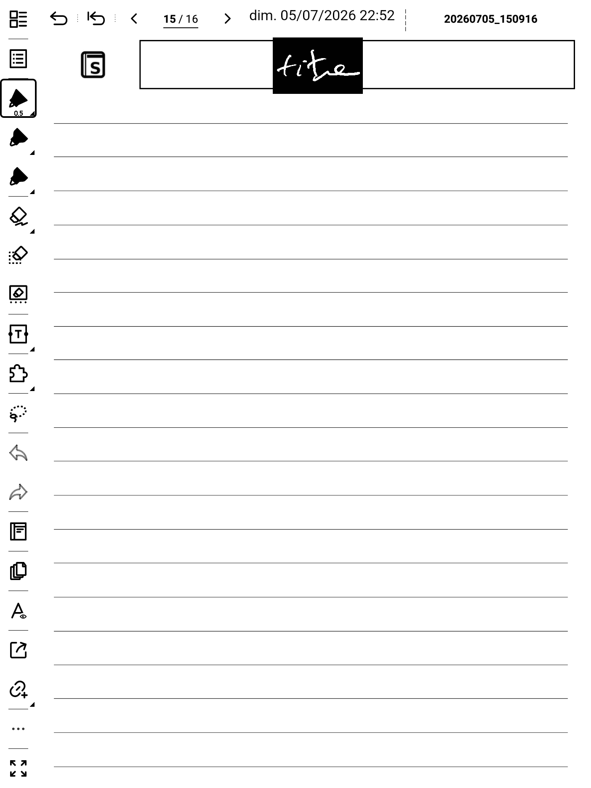
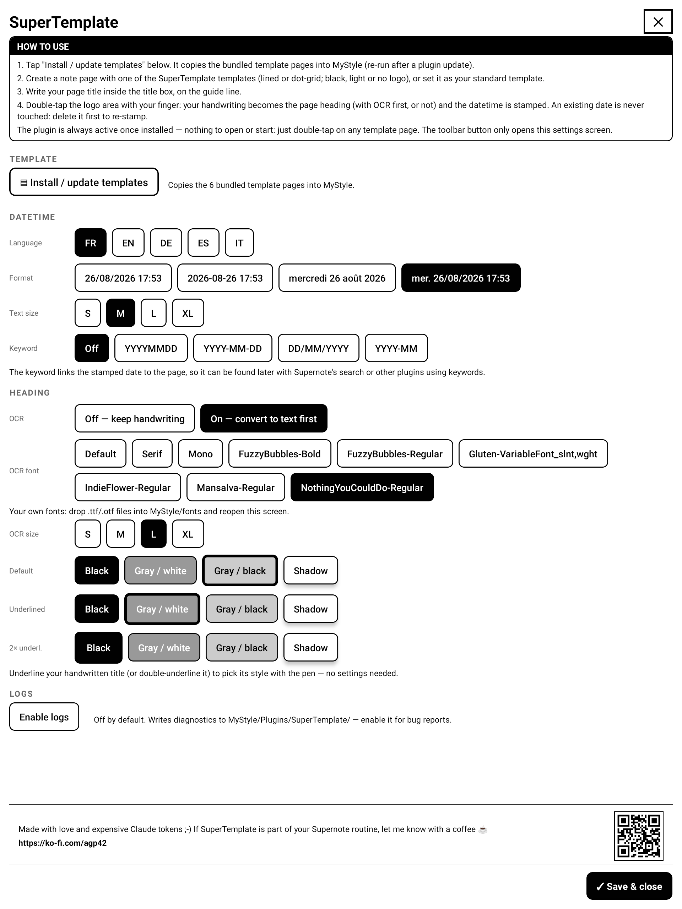
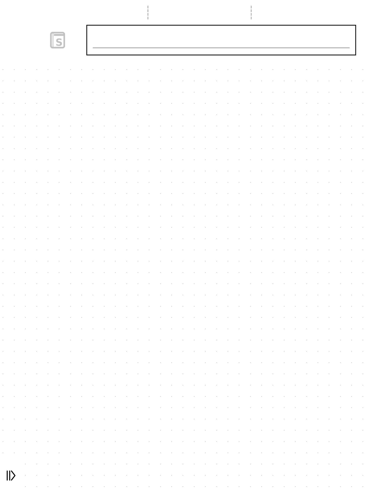
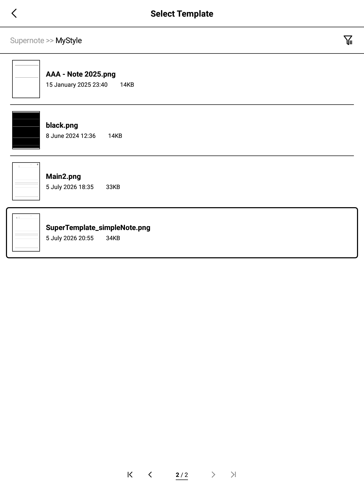
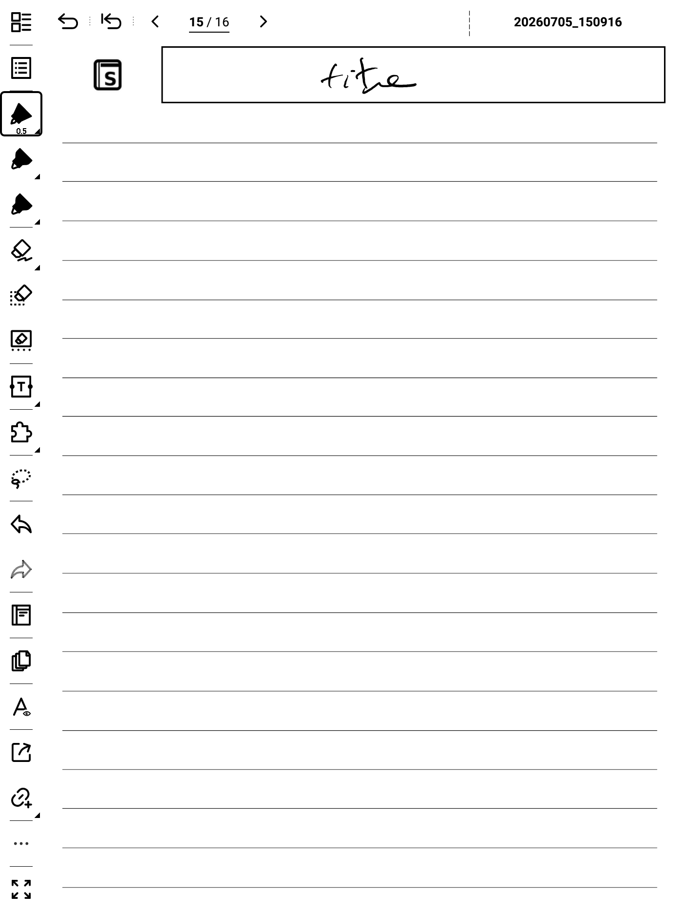
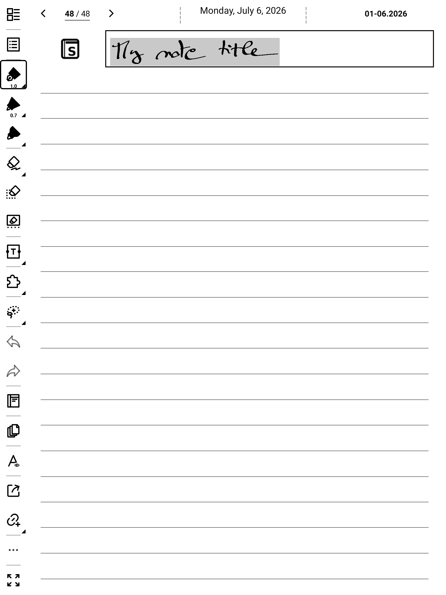
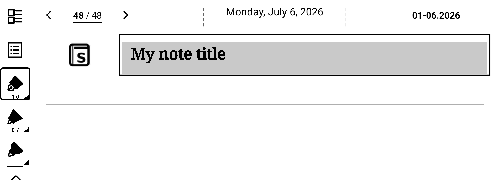
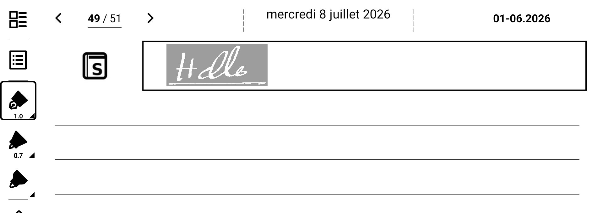
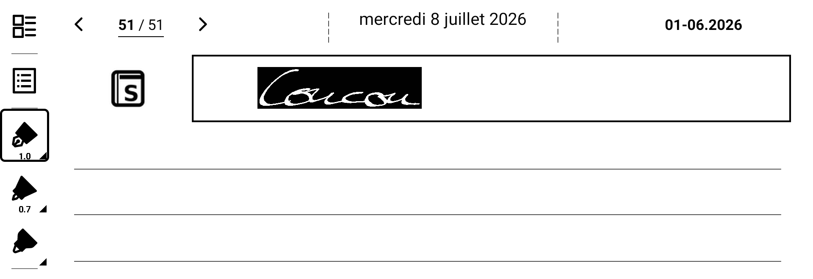
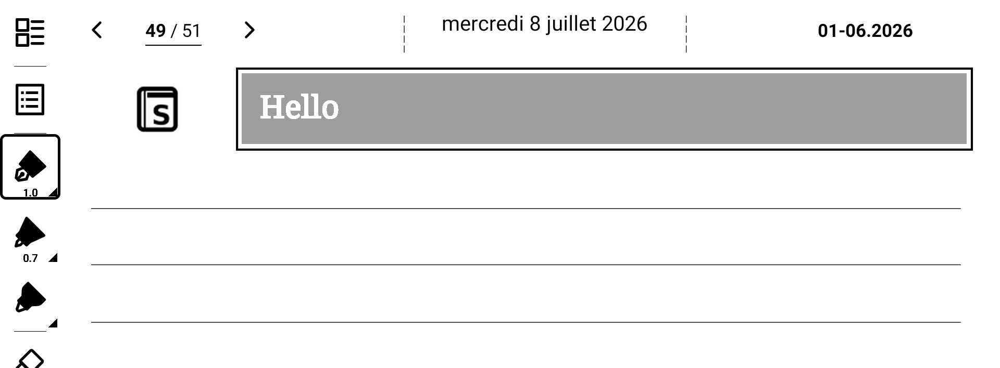

# SuperTemplate — User Manual

*Version 2.0.8 — for Supernote devices with plugin support (tested on A5 X and
Manta).*

SuperTemplate automates the header of your note pages: **double-tap the S logo**
printed on the template and the plugin stamps the current date & time, then
turns your page title into a real Supernote heading (visible in the note's
table of contents).

## Which build do I need? (Supernote firmware)

There are **two releases** — a build made for one firmware version does **not**
run on the other. Check your version under **Settings → About**:

- **v2.0.8** — for Chauvet **`3.29.43`** (Manta / Nomad) / **`2.26.40`**
  (A5 X / A6 X), the firmware that introduced the plugin **permission system**.
  This is the current build; it adds the dot-grid templates and fixes the title
  zone on notes made for another device.
- **v1.0.0** — for the previous firmware, Chauvet **`3.29.42`** (Manta / Nomad)
  / **`2.26.39`** (A5 X / A6 X), before the permission system.

Installing the wrong build shows *"package not compatible"* or the plugin does
nothing. The download links are in the project README under *"Which version do
I need?"*. The rest of this manual applies to both builds; the few places where
behaviour differs by firmware are called out inline.

## Installation

1. Copy the `supertemplate-X.Y.Z.snplg` that matches your firmware into the
   `MyStyle` folder of your device (USB file transfer or Supernote Partner).
2. On the device: **Settings → Apps → Plugins → Add Plugin** and select
   `supertemplate`. Once installed, the plugin appears in that list with its
   "S" icon and version number.
3. Open any note, open the plugin menu in the toolbar (puzzle-piece icon)
   and tap **SuperTemplate** to open the settings.
4. In the settings, tap **Install / update templates**. This copies the
   six bundled template pages into `MyStyle`, where Supernote picks them
   up as page templates. Re-run it after every plugin update.
   

**The plugin is always active once installed** — nothing to open or start:
it listens for the double-tap on every note page from the moment the device
boots. The toolbar button only opens the settings screen.

### File permission (Chauvet firmware only)

On the Chauvet firmware (`3.29.43` / `2.26.40`), the first time the
plugin acts on a page it asks the system for **file permission** (it needs to
read the note and its settings, and write the heading, date and keyword). Tap
**Allow** — or **Always allow** so it never asks again. If you decline, a popup
says *"file permission denied — grant it to stamp headings and dates"* and
nothing is stamped; double-tap again and allow it. The earlier firmware
(Chauvet `3.29.42` / `2.26.39`) has no permission system, so this step never
appears there.

## The templates

Six variants in two families, same header layout — pick the body ruling and the
logo you like:

- **Lined** — `SuperTemplate_simpleNote` (black S logo),
  `SuperTemplate_simpleNote_logoLight` (light gray logo),
  `SuperTemplate_simpleNote_noLogo` (no logo).
- **Dot-grid** — `SuperTemplate_dotGrid`, `SuperTemplate_dotGrid_logoLight`,
  `SuperTemplate_dotGrid_noLogo` (same three logo options, ruled lines replaced
  by a dot grid).

On the no-logo variants the double-tap zone is still there, left of the title
box. Each template has a **datetime slot** between the dashed marks at the top,
a **title box** with a **guide line** inside it, and the ruled or dotted body.

## Daily use

1. Create a note page with one of the SuperTemplate templates, or set one up
   as your standard template.
2. Write your page title in the title box, **sitting on the guide line**.
3. **Double-tap the logo area with your finger** — two quick taps, like a
   double-click (the pen never triggers).
   

The plugin then:
- writes the current date & time between the dashed marks at the top,
- registers an invisible date keyword (find the page later via Supernote's
  search, or from other plugins that use keywords),
- converts your title into a native heading.

In handwriting mode, your strokes stay and become the heading:

In OCR mode, they are replaced by typed text before the heading is applied:

### What counts as the title

Every stroke **touching the title box** is title ink — it is taken **whole**
even if a letter sticks out of the box, and so are deep descenders or an
underline drawn just below it. Two safety rules:

- if the title area would swallow **other writing** (a body line too close),
  the plugin refuses and tells you with a popup — nothing is converted;
- ink that never touches the box is never treated as a title.

A **typed text box** sitting in the title box works too: double-tap and it
becomes the heading.

### Pick the heading style with your pen

No need to open the settings to change one heading's look: **underline your
title** before double-tapping and the plugin applies the style you mapped to
that gesture — single underline and double underline each map to any of the
four native styles (Settings → Heading); no markup uses your default style.
The underline stroke is excluded from the OCR text, and cleaned up with the
rest of the handwriting in OCR mode.

### OCR mode details

- Sizes follow the Supernote text scale: **S 60 · M 90 · L 132 · XL 180**.
  A large title flows into the whitespace below the box; the plugin shrinks
  the font automatically when the title is too long for the page width.
- **Your own fonts**: drop `.ttf`/`.otf` files into `MyStyle/fonts` and they
  appear as choices next to Default / Serif / Mono.
- If a selection looks **bigger than a title**, OCR replacement is skipped for
  safety and a popup says so — your handwriting is kept as the heading rather
  than risk replacing a whole block of text.

### Updating the date

An existing date is never modified. To re-stamp: delete the date text box
(select it and delete), then double-tap the logo again.

### Idempotence

Double-tapping a page that already has its heading does nothing — a popup
says *"this page already has its heading"*. The date is never duplicated
either.

## Settings

Open via the toolbar plugin button. Everything is applied with
**✓ Save & close**.

| Section | Setting | Effect |
|---------|---------|--------|
| Template | Install / update templates | Copies/refreshes the 6 bundled templates (lined + dot-grid) into MyStyle |
| Datetime | Language | Day/month names (FR, EN, DE, ES, IT) |
| | Format | Four date formats, previewed live in your language |
| | Text size | Size of the date text (S/M/L/XL) |
| | Keyword | Off, or the format of the invisible date keyword |
| Heading | OCR | Off = keep your handwriting; On = recognize it and replace it with typed text **before** applying the heading |
| | OCR font / size | Font (built-in or from `MyStyle/fonts`) and size (Supernote scale, up to 180) of the typed text |
| | Default / Underlined / 2× underl. | The native heading style used with no pen markup, a single underline, or a double underline (buttons preview the result) |
| Logs | Enable logs | Off by default — enable to produce a diagnostics file for bug reports |

## The popups (toasts)

The plugin always tells you why nothing visible happened. Every message is
prefixed *SuperTemplate:* on the device.

| Message | Meaning |
|---------|---------|
| *title box is empty* | Nothing in the box to convert |
| *nothing to convert in the title box* | Ink was found nearby but nothing touches the box |
| *another text box is in the way — no heading applied* | A second text box overlaps the title area |
| *the title area touches other writing — nothing converted* | Converting would swallow a body line — move it or write the title smaller |
| *the title reaches too far down — nothing converted* | A stroke drags the title area deep into the page |
| *selection looks bigger than a title — OCR replacement skipped for safety* | OCR skipped; your handwriting is kept as the heading |
| *the device refused to heading the typed title* | The firmware rejected applying a heading to the typed/OCR title |
| *this view does not accept handwriting here* | The current view can't take handwriting actions right now |
| *this page already has its heading* | Idempotence — nothing to do |
| *this page was created for a larger device — not supported on this screen yet* | Foreign page from a bigger model (see *Notes created on another device*) |
| *file permission denied — grant it to stamp headings and dates* | You declined the file permission (Chauvet firmware) — re-trigger and allow |
| *the conversion went wrong (firmware) — the page was cleaned, no heading applied. Trigger again* | Firmware paste bug (see below); the page was cleaned, double-tap again |

## Files

Everything lives in `MyStyle/Plugins/SuperTemplate/`:
- `SuperTemplate_Config.json` — your settings. Advanced: the `templates`
  array holds each template's zones as **ratios (0–1) of the page size** —
  edit them to adapt the plugin to your own template PNG.
- `SuperTemplate_Log.txt` — diagnostics log (attach it to bug reports; it is
  only written when *Enable logs* is on, and rotates at 512 KB).

## Troubleshooting

- **Nothing happens on double-tap**: use a finger (the pen never triggers);
  the two taps must be quick — like a double-click — and close together;
  make sure the page uses a SuperTemplate template; check the popups and the
  log file.
- **A popup explains a refusal**: see *The popups* table above.
- **"file permission denied"** (Chauvet firmware): you declined the system
  permission — double-tap again and tap Allow / Always allow.
- **No date stamped**: a date is probably already present (see *Updating the
  date*).
- **Plugin missing from the toolbar**: uninstall then reinstall the plugin
  (Settings → Apps → Plugins).

## Notes created on another device

Pages created on a smaller device (e.g. A5 X notes opened on a Manta) are
displayed 1:1 and centered — the plugin handles this automatically:
double-tap the logo where you see it. Pages created on a LARGER device are
not supported yet; the plugin tells you so with a popup and does nothing.

## Firmware bugs it works around (older firmware only)

Two Supernote firmware bugs affected the plugin on the older firmware
(Chauvet `3.29.42` / `2.26.39`). **Both are fixed on the Chauvet firmware
(`3.29.43` / `2.26.40`)**, so the plugin runs noticeably cleaner there; the
safeguards below stay in the code as a dormant net.

### The paste bug

On the older firmware, if you have lasso-copied content in the copy buffer, the
firmware spontaneously pastes it into the page during any plugin lasso
operation — it can even hijack the heading conversion itself. This is a
**firmware bug**, [reported and confirmed by Ratta](https://www.reddit.com/r/Supernote_dev/comments/1uodbvo/).

SuperTemplate defuses it end to end: pasted ghost content is detected and
removed, and a hijacked conversion is repaired on the fly (the heading is
re-pointed to *your* title). In the rare case where repair is impossible,
the page is cleaned and a popup asks you to double-tap again. The extra
screen flashes during processing are that cleanup at work. On the Chauvet
firmware the phantom paste no longer happens, so those extra flashes are gone.

### Old versions stacking on disk

On the older firmware, Supernote's PluginHost keeps every previously installed
version of a plugin on disk ([bug report](https://www.reddit.com/r/Supernote_dev/comments/1uo2y0g/));
SuperTemplate cleans its own old versions automatically at startup. The Chauvet
firmware auto-cleans them itself, so this guard is redundant there.

## Credits

- [gorlix/SuperFlow](https://github.com/gorlix/SuperFlow) — the zone/action
  architecture that inspired this plugin, and the on-device log-file
  debugging technique.
- [taoist22/sn-datetime](https://github.com/taoist22/sn-datetime) — the
  datetime stamp concept and the searchable date-keyword trick.
- [Laumss/Inkling](https://github.com/Laumss/Inkling) (MIT) — the floating
  bubble native module adapted from its code (currently dormant), and the
  Supernote plugin development knowledge base.
